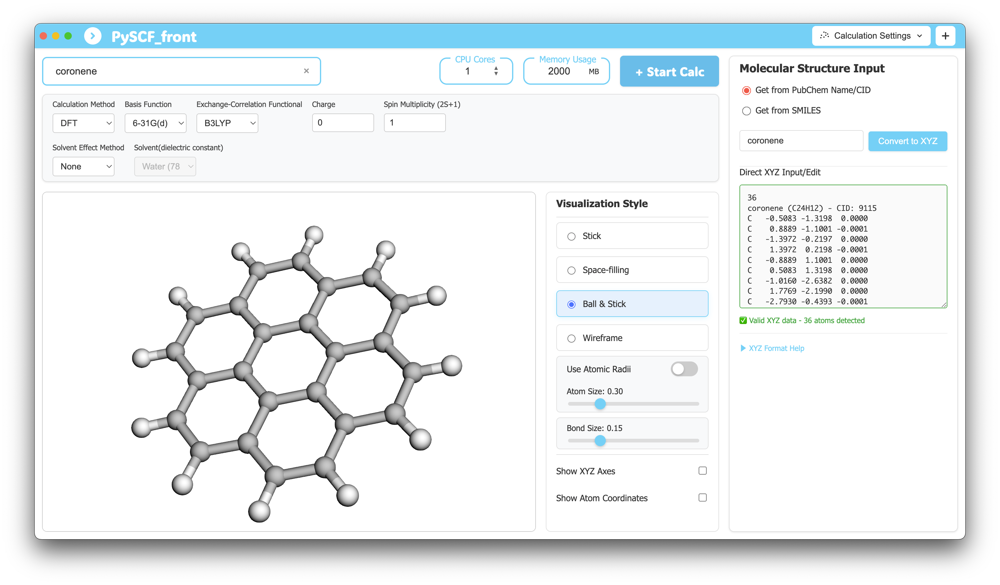

# PySCF_front

This is a quantum chemistry application built with **Electron**, **React (TypeScript)**, and **Python (Flask)**. It leverages PySCF and RDKit on the backend, providing a desktop application for molecular structure visualization, data retrieval from PubChem, and the execution of quantum chemistry calculations such as Density Functional Theory (DFT).

---

## Key Features

-   **3D Molecular Visualization**: Interactively display and manipulate molecular structures using 3Dmol.js.
-   **Structure Retrieval**:
    -   Fetch 3D structures from the PubChem database by compound name or CID.
    -   Convert SMILES strings into 3D structures.
-   **Quantum Chemistry Calculations**:
    -   Execute various calculation methods via PySCF, including DFT, HF, MP2, CCSD, and TDDFT.
    -   Perform **geometry optimization** and **vibrational frequency analysis**.
    -   Analyze results, including SCF energy, molecular orbitals (HOMO/LUMO), and more.
-   **Calculation History**: View, rename, and delete past calculation results.
-   **AI-Powered Multi-Agent System**:
    -   **Molecular Agent**: Assists with quantum chemistry calculations and molecular analysis using natural language.
    -   **Research Agent**: Searches arXiv for relevant academic papers and provides summaries with PDF links.
    -   **Intelligent Routing**: Automatically routes queries to the appropriate specialist agent based on user intent.
-   **Automated Environment Setup**: Set up the complete development environment with a single command (`npm run setup-env`).
-   **Environment Validation**: Automatically verify Python dependencies and environment health (`npm run verify-env`).
-   **Unified Execution Environment**: Uses a Gunicorn-based server for both development and production to eliminate environment-specific issues.
-   **Centralized Configuration**: Manages server behavior through a single JSON configuration file.

---

## Tech Stack

-   **Frontend**: React, TypeScript, TanStack Query, Zustand
-   **Backend**: Python, Flask, Gunicorn, PySCF, RDKit
-   **Desktop Framework**: Electron
-   **Build Tools**: Webpack, Electron Builder, conda-pack
-   **Package Management**: npm (Node.js), conda (Python)
-   **API Specification**: OpenAPI (Swagger)

---

## Application Screenshot



---

## Getting Started

### Quick Start (Recommended)

Follow these steps to set up the development environment easily:

1.  **Clone the repository:**
    ```bash
    git clone [https://github.com/kam6y/Pyscf_front.git](https://github.com/kam6y/Pyscf_front.git)
    cd Pyscf_front
    ```

2.  **Install Node.js dependencies:**
    ```bash
    npm install
    ```

3.  **Run the automated environment setup script:**
    This command will check for a conda environment, create one if necessary, install all dependencies, and verify the setup.
    ```bash
    npm run setup-env
    ```

4.  **Verify the environment (optional but recommended):**
    ```bash
    # Check environment health
    npm run verify-env
    ```

5.  **Launch the application in development mode:**
    ```bash
    conda activate pyscf-env
    npm run dev
    ```

### Manual Setup

If you prefer to manage the conda environment manually:

1.  **Clone and install Node.js dependencies** as shown above.

2.  **Set up the Python environment (conda is required):**
    ```bash
    # Example for installing Miniforge on macOS ARM
    curl -L -O "[https://github.com/conda-forge/miniforge/releases/latest/download/Miniforge3-MacOSX-arm64.sh](https://github.com/conda-forge/miniforge/releases/latest/download/Miniforge3-MacOSX-arm64.sh)"
    bash Miniforge3-MacOSX-arm64.sh -b

    # Initialize conda (or use: conda init)
    CONDA_BASE=$(conda info --base)
    source "$CONDA_BASE/etc/profile.d/conda.sh"

    # Create the conda environment from the environment.yml file
    conda env create -f .github/environment.yml
    
    # Activate the environment
    conda activate pyscf-env
    ```
    > **Important**: This project requires a conda environment. The application will display an error dialog if the environment is not configured correctly.

#### Custom Conda Environment Path

The application automatically detects the conda environment. If your environment is in a non-standard location, you can specify the path using the `CONDA_ENV_PATH` environment variable:
```bash
export CONDA_ENV_PATH="/path/to/your/pyscf-env"
```

---

## Application Packaging

To build a distributable version of the application for your platform, run the following commands:

```bash
# Verify the build environment (recommended)
npm run verify-build-env

# Run the complete build process with validations
npm run build

# Validate the completeness of the build artifacts
npm run validate-build

# Create the distributable package
npm run package
```

### Distribution Features

-   **No conda installation required**: The complete environment is bundled.
-   **Ready to run**: Usable immediately after installation.
-   **Isolated Environment**: Does not interfere with the system's Python environment.

### Generated Files

The packaging process creates platform-specific installers in the `dist/` directory:
-   `PySCF_front-darwin-arm64.dmg` (For macOS)
-   `PySCF_front-win32-x64.exe` (For Windows)
-   `PySCF_front-linux-x86_64.AppImage` (For Linux)

### Building for Linux on Windows

There are two methods for building Linux applications on Windows:

#### Method 1: Using Docker (Recommended)

This is the simplest method, requiring only Docker Desktop with WSL2 backend.

**Prerequisites:**
- Docker Desktop installed and running
- WSL2 enabled

**Build Command:**
```bash
# Build Docker image and create Linux package (one command)
npm run package:linux:docker
```

This command automatically:
1. Builds a Docker image with all necessary dependencies
2. Runs the build inside a Linux container
3. Outputs the AppImage to the `dist/` directory on your host machine

**Advanced Usage:**
```bash
# Build Docker image only
npm run docker:build

# Run build with existing image (faster for subsequent builds)
npm run docker:package
```

#### Method 2: Using WSL Directly

For more control, you can build directly in WSL (Windows Subsystem for Linux):

**Prerequisites:**
1. **WSL2** installed with a Linux distribution (Ubuntu recommended)
2. **Miniforge** installed in WSL environment
3. **Node.js** installed in WSL environment

**Setup in WSL**
```bash
# Access WSL
wsl

# Install Miniforge in WSL
curl -L -O "https://github.com/conda-forge/miniforge/releases/latest/download/Miniforge3-Linux-x86_64.sh"
bash Miniforge3-Linux-x86_64.sh -b

# Initialize conda
CONDA_BASE=$(conda info --base)
source "$CONDA_BASE/etc/profile.d/conda.sh"

# Navigate to your project directory (example)
cd /mnt/c/Users/YOUR_USERNAME/Documents/PySCF_front

# Install Node.js dependencies
npm install

# Create conda environment from environment.yml
conda env create -f .github/environment.yml

# Activate the environment
conda activate pyscf-env

# Verify the setup
npm run verify-env
```

#### Building Linux Application
```bash
# In WSL, with pyscf-env activated
conda activate pyscf-env

# Build and package for Linux
npm run package:linux
```

The built AppImage will be available in the `dist/` directory.

**Note**: The `package:linux` script automatically runs the full build process (code generation, webpack build, conda-pack, PyInstaller, and electron-builder) in the Linux environment.

---

## Troubleshooting

Always start by running the verification commands to identify the problem:

```bash
conda activate pyscf-env

# Comprehensive environment check
npm run verify-env

# Check build tools
npm run verify-build-env

# Check server configuration
npm run debug:config
```

These commands provide detailed diagnostic information and troubleshooting steps if any issues are detected.

---
---

# PySCF_front (日本語)

これは、**Electron**、**React (TypeScript)**、**Python (Flask)** を使用して構築された、量子化学計算アプリケーションです。

PySCFとRDKitをバックエンドに利用し、分子構造の可視化、PubChemからの分子データ取得、そしてDFT（密度汎関数理論）、HF（ハートリー・フォック法）、MP2、CCSD、TDDFT計算などを実行できるデスクトップアプリケーションを目指して開発しています。

## 主な機能

-   **3D分子可視化:** 3Dmol.jsを利用して、分子構造をインタラクティブに表示・操作できます。
-   **分子構造の取得:**
    -   PubChemのデータベースから、化合物の名称やCIDで検索し、3D構造を取得します。
    -   SMILES形式の文字列を3D構造に変換します。
-   **量子化学計算:**
    -   PySCFを利用して、DFT、HF、MP2、CCSD、TDDFTなどの量子化学計算を実行します。
    -   **構造最適化**と**振動数解析**をサポート。
    -   計算結果（SCFエネルギー、分子軌道、NTO解析など）を表示します。
-   **計算履歴の管理:** 過去の計算結果を一覧表示し、名前の変更や削除が可能です。
-   **AIマルチエージェントシステム:**
    -   **分子エージェント:** 自然言語を使用して量子化学計算と分子解析をサポート。
    -   **リサーチエージェント:** arXivから関連論文を検索し、PDFリンク付きの要約を提供。
    -   **知的ルーティング:** ユーザーの質問内容に基づいて、適切な専門エージェントに自動的にルーティング。
-   **自動環境構築:** ワンコマンドで開発環境をセットアップできます（`npm run setup-env`）。
-   **環境検証機能:** Python依存関係と環境の健全性を自動チェックします（`npm run verify-env`）。
-   **統一実行環境:** 開発・本番環境で同一のGunicornベースサーバーを使用し、環境差異問題を解決。
-   **リアルタイム更新:** WebSocketを利用して計算状況をリアルタイムにUIへ反映します。

## 技術スタック

-   **フロントエンド:** React, TypeScript, TanStack Query, Zustand
-   **バックエンド:** Python, Flask, Gunicorn, PySCF, RDKit
-   **デスクトップフレームワーク:** Electron
-   **ビルドツール:** Webpack, Electron Builder, conda-pack
-   **パッケージ管理:** npm (Node.js), conda (Python)
-   **API仕様:** OpenAPI (Swagger)

## アプリケーション画面


## 開発の始め方

### クイックスタート（推奨）

1.  **リポジトリをクローン:**
    ```bash
    git clone [https://github.com/kam6y/Pyscf_front.git](https://github.com/kam6y/Pyscf_front.git)
    cd Pyscf_front
    ```

2.  **Node.jsの依存関係をインストール:**
    ```bash
    npm install
    ```

3.  **自動環境構築スクリプトを実行:**
    このコマンドは、conda環境の作成と必要なPythonパッケージのインストールを自動で行います。
    ```bash
    npm run setup-env
    ```

4.  **環境を検証 (推奨):**
    ```bash
    npm run verify-env
    ```

5.  **開発モードでアプリケーションを起動:**
    ```bash
    conda activate pyscf-env
    npm run dev
    ```

### 手動セットアップ

1.  **Node.js依存関係のインストール**は上記と同様です。

2.  **Python環境を設定 (condaが必須):**
    ```bash
    # Miniforgeのインストール (例: Apple Silicon Mac)
    curl -L -O "[https://github.com/conda-forge/miniforge/releases/latest/download/Miniforge3-MacOSX-arm64.sh](https://github.com/conda-forge/miniforge/releases/latest/download/Miniforge3-MacOSX-arm64.sh)"
    bash Miniforge3-MacOSX-arm64.sh -b

    # condaを初期化 (または: conda init)
    CONDA_BASE=$(conda info --base)
    source "$CONDA_BASE/etc/profile.d/conda.sh"

    # environment.ymlからconda環境を作成
    conda env create -f .github/environment.yml
    
    # 環境をアクティブ化
    conda activate pyscf-env
    ```

### conda環境のカスタムパス設定

アプリケーションはconda環境を自動検出しますが、標準的でない場所にインストールした場合は環境変数でパスを指定できます。
```bash
export CONDA_ENV_PATH="/path/to/your/pyscf-env"
```

## アプリケーションのパッケージ化

プラットフォームに応じた配布用のアプリケーションをビルドするには、以下のコマンドを実行します。

```bash
# ビルド前環境確認（推奨）
npm run verify-build-env

# 完全ビルド（検証付き）
npm run build

# ビルド完了後の検証
npm run validate-build

# パッケージ作成
npm run package
```

### 配布の特徴

-   **condaのインストール不要**: 完全なPython環境が同梱されます。
-   **即座に実行可能**: インストール後すぐに使用できます。
-   **環境の隔離**: システムのPython環境に影響を与えません。

### 生成されるファイル

`dist/`ディレクトリに各OS用のインストーラーが生成されます。
-   `PySCF_front-darwin-arm64.dmg` (macOS)
-   `PySCF_front-win32-x64.exe` (Windows)
-   `PySCF_front-linux-x86_64.AppImage` (Linux)

## トラブルシューティング

問題が発生した場合は、まず以下の検証コマンドを実行して問題を特定してください。

```bash
conda activate pyscf-env

# 環境の包括的チェック
npm run verify-env

# ビルドツールの確認
npm run verify-build-env

# サーバー設定の確認
npm run debug:config
```

これらのコマンドは、Pythonのバージョン、依存関係、サーバー設定などをチェックし、詳細な診断情報を提供します。