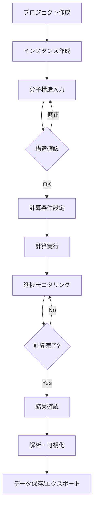
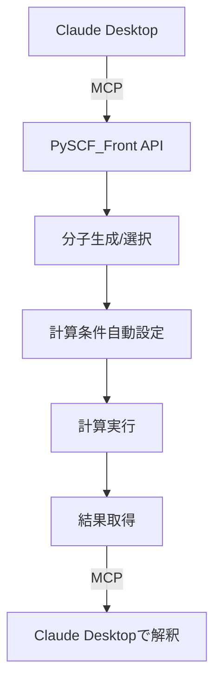

# PySCF_Front 要件定義書 v1.0

## 目次

1. [プロジェクト概要](#1-プロジェクト概要)
   - 1.1 [プロダクト名](#11-プロダクト名)
   - 1.2 [プロダクト概要](#12-プロダクト概要)
   - 1.3 [開発技術スタック](#13-開発技術スタック)
   - 1.4 [プロジェクト目的](#14-プロジェクト目的)

2. [対象ユーザー・利用環境](#2-対象ユーザー利用環境)
   - 2.1 [対象ユーザー](#21-対象ユーザー)
   - 2.2 [ユーザー専門知識レベル](#22-ユーザー専門知識レベル)
   - 2.3 [対象OS](#23-対象os)
   - 2.4 [展開形態](#24-展開形態)

3. [性能・規模要件](#3-性能規模要件)
   - 3.1 [同時計算ジョブ数](#31-同時計算ジョブ数)
   - 3.2 [計算対象分子サイズ](#32-計算対象分子サイズ)
   - 3.3 [レスポンス時間](#33-レスポンス時間)
   - 3.4 [リソース要件](#34-リソース要件)

4. [機能要件](#4-機能要件)
   - 4.1 [分子構造入力機能](#41-分子構造入力機能)
   - 4.2 [対応計算手法](#42-対応計算手法)
   - 4.3 [計算結果表示機能](#43-計算結果表示機能)
   - 4.4 [GPU対応](#44-gpu対応)
   - 4.5 [多言語対応](#45-多言語対応)
   - 4.6 [インスタンス管理機能](#46-インスタンス管理機能)
   - 4.7 [MCPサーバー連携機能](#47-mcpサーバー連携機能オプション)

5. [データ管理要件](#5-データ管理要件)
   - 5.1 [ファイル管理](#51-ファイル管理)
   - 5.2 [データ保存](#52-データ保存)
   - 5.3 [データ共有](#53-データ共有)
   - 5.4 [データベース設計](#54-データベース設計)

6. [アーキテクチャ要件](#6-アーキテクチャ要件)
   - 6.1 [拡張性設計](#61-拡張性設計)
   - 6.2 [PySCFアップデート対応](#62-pyscfアップデート対応)
   - 6.3 [MCPサーバー機能](#63-mcpサーバー機能オプション)
   - 6.4 [システムアーキテクチャ](#64-システムアーキテクチャ)

7. [技術的詳細](#7-技術的詳細)
   - 7.1 [Flutter-Python間通信](#71-flutter-python間通信)
   - 7.2 [MySQL実装詳細](#72-mysql実装詳細)
   - 7.3 [プラグインアーキテクチャ](#73-プラグインアーキテクチャ)
   - 7.4 [MCPサーバー実装](#74-mcpサーバー実装オプション)

8. [ユーザーインターフェース](#8-ユーザーインターフェース)
   - 8.1 [画面構成](#81-画面構成)
   - 8.2 [主要画面の詳細](#82-主要画面の詳細)
   - 8.3 [ワークフロー](#83-ワークフロー)
   - 8.4 [UIデザイン原則](#84-uiデザイン原則)
   - 8.5 [MCPサーバー使用例](#85-mcpサーバー使用例オプション機能)

9. [機能の優先順位](#9-機能の優先順位)
   - 9.1 [Phase 1（初期リリース）](#91-phase-1初期リリース)
   - 9.2 [Phase 2（拡張機能）](#92-phase-2拡張機能)
   - 9.3 [Phase 3（高度な機能）](#93-phase-3高度な機能)
   - 9.4 [将来的機能](#94-将来的機能)

10. [セキュリティ・認証要件](#10-セキュリティ認証要件)
    - 10.1 [認証機能](#101-認証機能)
    - 10.2 [機密性](#102-機密性)
    - 10.3 [データ保護](#103-データ保護)
    - 10.4 [MCPサーバーセキュリティ](#104-mcpサーバーセキュリティオプション)

11. [エラーハンドリング・ログ要件](#11-エラーハンドリングログ要件)
    - 11.1 [エラー処理](#111-エラー処理)
    - 11.2 [ログ出力](#112-ログ出力)
    - 11.3 [監視・アラート](#113-監視アラート)

12. [テスト要件](#12-テスト要件)
    - 12.1 [テスト戦略](#121-テスト戦略)
    - 12.2 [テストケース](#122-テストケース)
    - 12.3 [品質基準](#123-品質基準)

13. [非機能要件](#13-非機能要件)
    - 13.1 [保守性](#131-保守性)
    - 13.2 [可用性](#132-可用性)
    - 13.3 [ユーザビリティ](#133-ユーザビリティ)
    - 13.4 [パフォーマンス](#134-パフォーマンス)

14. [開発・運用要件](#14-開発運用要件)
    - 14.1 [開発環境](#141-開発環境)
    - 14.2 [リリース戦略](#142-リリース戦略)
    - 14.3 [CI/CDパイプライン](#143-cicdパイプライン)

15. [その他の検討要素](#15-その他の検討要素)
    - 15.1 [ライセンス管理](#151-ライセンス管理)
    - 15.2 [ドキュメンテーション](#152-ドキュメンテーション)
    - 15.3 [コミュニティ構築](#153-コミュニティ構築)
    - 15.4 [監視・分析](#154-監視分析)

16. [リスク管理](#16-リスク管理)
    - 16.1 [技術的リスク](#161-技術的リスク)
    - 16.2 [プロジェクトリスク](#162-プロジェクトリスク)
    - 16.3 [リスク軽減策](#163-リスク軽減策)

17. [用語集](#17-用語集)

18. [付録A: MCPサーバー設定ガイド](#18-付録a-mcpサーバー設定ガイド)
    - 18.1 [MCPサーバーの有効化](#181-mcpサーバーの有効化)
    - 18.2 [使用可能なMCPツール](#182-使用可能なmcpツール)
    - 18.3 [トラブルシューティング](#183-トラブルシューティング)

---

**文書情報**
- バージョン: 1.2
- 作成日: 2025-01-14
- 最終更新日: 2025-01-14（MCPサーバーをオプション機能に変更、Claude Desktop連携方式を追加）
- 承認者: [プロジェクトマネージャー]
- レビュー予定日: 2025-04-14

## 1. プロジェクト概要

### 1.1 プロダクト名
**PySCF_Front**（仮称）

### 1.2 プロダクト概要
PySCF_Frontは、量子化学計算を行うためのクロスプラットフォーム対応ネイティブアプリケーションです。研究者や学生が専門的なプログラミング知識なしに、直感的なGUIを通じて高度な量子化学計算を実行できることを目的としています。

本アプリケーションは、分子構造と計算条件を組み合わせた「インスタンス」という概念を中心に設計され、複数の計算を順次または並列で実行する機能を提供します。また、オプションでMCPサーバー機能を有効化することで、Claude Desktopなどの外部アプリケーションから自然言語での操作も可能になります。

### 1.3 開発技術スタック
- **バックエンド**: Python 3.14 (PySCF、RDKit、NumPy、SciPy)
- **フロントエンド**: Flutter 3.32 (Dart)
- **通信**: gRPC (Protocol Buffers)
- **データベース**: MySQL 8.0+
- **GPU計算**: GPU4PySCF (CUDA 11.0+)
- **MCP連携**: MCPサーバー (オプション、Claude Desktop連携用)
- **ビルドツール**: CMake、Gradle、CocoaPods
- **バージョン管理**: Git

### 1.4 プロジェクト目的
1. 量子化学計算のアクセシビリティ向上
2. 研究効率の最大化
3. 計算資源の最適活用
4. 研究データの体系的管理
5. 外部ツールとの柔軟な連携基盤構築（MCPサーバー等）

## 2. 対象ユーザー・利用環境

### 2.1 対象ユーザー
**主要ユーザー**
- 大学・研究機関の研究者
- 大学院生（修士・博士課程）
- 企業の研究開発部門
- 計算化学専門家

**二次的ユーザー**
- 学部生（化学・物理学専攻）
- 教育機関の教員
- 材料科学研究者

### 2.2 ユーザー専門知識レベル
| 知識領域 | 要求レベル | 詳細 |
|---------|----------|------|
| PySCF | 不要 | アプリケーションで完全に抽象化 |
| プログラミング | 不要 | GUIで全操作可能 |
| 量子化学 | 高 | 計算手法・基底関数の選択能力必要 |
| 分子構造 | 中 | 基本的な分子構造の理解必要 |

### 2.3 対象OS
| OS | 優先度 | 備考 |
|----|-------|------|
| macOS | 高 | 開発環境として優先 |
| Windows | 高 | GPU計算対応のため必須 |
| Linux | 中 | Ubuntu 20.04+, CentOS 8+ |

### 2.4 展開形態
- **初期**: スタンドアロン・ローカルアプリケーション
- **中期**: ネットワークライセンス対応
- **将来**: クラウド/オンプレミスハイブリッド対応

## 3. 性能・規模要件

### 3.1 同時計算ジョブ数
- **最大同時実行数**: 4ジョブ
- **推奨同時実行数**: 1-2ジョブ
- **キュー管理**: 無制限（実行待機）

### 3.2 計算対象分子サイズ
| 計算手法 | 最大原子数 | 推奨原子数 |
|---------|-----------|-----------|
| HF/DFT | 1000 | 500以下 |
| MP2 | 500 | 200以下 |
| CCSD | 100 | 50以下 |
| CCSD(T) | 50 | 30以下 |

### 3.3 レスポンス時間
- **UI操作**: 100ms以内
- **ファイル読み込み**: 1秒以内（100原子以下）
- **3D表示更新**: 60fps
- **計算開始**: 5秒以内

### 3.4 リソース要件
**最小要件**
- CPU: 4コア以上
- RAM: 8GB
- ストレージ: 50GB空き容量
- GPU: なし（CPU計算のみ）

**推奨要件**
- CPU: 8コア以上
- RAM: 32GB以上
- ストレージ: 500GB SSD
- GPU: NVIDIA RTX 3060以上（CUDA対応）

## 4. 機能要件

### 4.1 分子構造入力機能

#### 4.1.1 ファイル入力
- **対応形式**
  - XYZ形式（.xyz）
  - MOL形式（.mol）※将来対応
  - SDF形式（.sdf）※将来対応

#### 4.1.2 直接入力
- **デカルト座標入力**
  - テキストエディタ形式
  - 表形式入力
  - インポート/エクスポート機能

- **Z-matrix入力**
  - 内部座標指定
  - 自動変換機能

#### 4.1.3 外部データソース連携
- **PubChem統合**
  - 化合物名検索
  - CID指定検索
  - 構造式表示・確認

- **SMILES入力**
  - RDKitによる3D構造生成
  - 立体配座最適化

### 4.2 対応計算手法

#### 4.2.1 基本的手法
- **Hartree-Fock (HF)**
  - RHF (Restricted)
  - UHF (Unrestricted)
  - ROHF (Restricted Open-shell)

- **密度汎関数理論 (DFT)**
  - LDA: SVWN
  - GGA: PBE, BLYP, PW91
  - Hybrid: B3LYP, PBE0, HSE06
  - Meta-GGA: TPSS, M06-L
  - Range-separated: CAM-B3LYP, ωB97X-D

#### 4.2.2 ポスト-HF法
- **摂動論**
  - MP2
  - MP3※将来対応
  - MP4※将来対応

- **配置間相互作用**
  - CIS
  - CISD
  - FCI※小分子のみ

- **結合クラスター**
  - CCSD
  - CCSD(T)
  - EOM-CCSD※将来対応

#### 4.2.3 励起状態計算
- **TDDFT**
- **CIS**
- **EOM-CCSD**※将来対応
- **SAC-CI**※将来対応

### 4.3 計算結果表示機能

#### 4.3.1 基本出力
- **エネルギー情報**
  - 全エネルギー（Hartree, eV, kcal/mol）
  - 軌道エネルギー
  - HOMO-LUMOギャップ

- **分子軌道情報**
  - エネルギー準位図
  - 軌道係数
  - 占有数

#### 4.3.2 電子状態解析
- **電荷分布**
  - Mulliken電荷
  - Löwdin電荷※将来対応
  - NBO解析※将来対応

- **双極子モーメント**
  - 大きさと方向
  - 3D可視化

#### 4.3.3 分光学的性質
- **振動解析**
  - IRスペクトル
  - 振動モード可視化
  - 熱力学的性質

- **電子スペクトル**
  - UV-Visスペクトル
  - 振動子強度
  - 遷移密度※将来対応

#### 4.3.4 熱力学的性質
- 温度・圧力依存性
- ゼロ点エネルギー補正
- エンタルピー・エントロピー・自由エネルギー
- 熱容量

#### 4.3.5 可視化機能
- **3D分子構造**
  - Ball-and-stick表示
  - Space-filling表示
  - 結合長・角度測定

- **分子軌道3D表示**
  - 等値面表示
  - 透明度調整
  - カラーマップ選択

### 4.4 GPU対応
- GPU4PySCF統合
- CUDA 11.0+対応
- 自動GPU検出・選択
- CPU/GPUハイブリッド計算

### 4.5 多言語対応
- 日本語（デフォルト）
- 英語
- 中国語※将来対応
- UI言語の動的切り替え

### 4.6 インスタンス管理機能
- インスタンスの作成・編集・削除
- テンプレート機能
- バッチ処理
- 依存関係管理

### 4.7 MCPサーバー連携機能（オプション）
PySCF_FrontはMCPサーバーとして動作し、Claude Desktopアプリから操作可能です。この機能は完全にオプションであり、通常のGUI操作に影響しません。

#### 4.7.1 連携方式
- **独立動作**: PySCF_FrontとClaude Desktopは別々のアプリケーションとして動作
- **MCP通信**: Model Context Protocolを使用した疎結合連携
- **ユーザー選択制**: 設定から有効/無効を切り替え可能

#### 4.7.2 提供機能
**Claude Desktop側から利用可能な機能**
- 自然言語による分子構造生成
- 計算条件の推奨と設定
- 計算ジョブの実行・監視
- 結果の取得と解釈
- エラー診断と対処法提案

#### 4.7.3 使用イメージ
```
┌─────────────────────────┐    ┌─────────────────────────┐
│   PySCF_Front (GUI)     │    │   Claude Desktop        │
│                         │    │                         │
│  通常のGUI操作が可能    │◀──▶│ 「水分子のHF計算を実行  │
│  MCPサーバーとして動作  │MCP │  して結果を解釈して」   │
│                         │    │                         │
└─────────────────────────┘    └─────────────────────────┘
```

## 5. データ管理要件

### 5.1 ファイル管理
#### 5.1.1 入力ファイル
- プロジェクトファイル（.psfp）
- 分子構造ファイル
- 計算設定ファイル（JSON）

#### 5.1.2 出力ファイル
- 結果サマリー（PDF/HTML）
- 生データ（HDF5）
- 可視化データ（VTK）

### 5.2 データ保存
- ローカルストレージ（デフォルト）
- ネットワークストレージ対応
- 自動バックアップ機能
- バージョン管理

### 5.3 データ共有
- インスタンスファイルのエクスポート/インポート
- 結果の選択的共有
- 読み取り専用モード

### 5.4 データベース設計

#### 5.4.1 テーブル構造
```sql
-- インスタンス管理
CREATE TABLE instances (
    id VARCHAR(36) PRIMARY KEY,
    name VARCHAR(255) NOT NULL,
    description TEXT,
    created_at TIMESTAMP DEFAULT CURRENT_TIMESTAMP,
    updated_at TIMESTAMP DEFAULT CURRENT_TIMESTAMP ON UPDATE CURRENT_TIMESTAMP,
    status ENUM('draft', 'ready', 'running', 'completed', 'error'),
    user_id VARCHAR(36),
    project_id VARCHAR(36),
    INDEX idx_status (status),
    INDEX idx_user_id (user_id)
);

-- 分子情報
CREATE TABLE molecules (
    id VARCHAR(36) PRIMARY KEY,
    instance_id VARCHAR(36) NOT NULL,
    name VARCHAR(255),
    formula VARCHAR(100),
    molecular_weight DECIMAL(10,4),
    geometry_type ENUM('xyz', 'zmatrix'),
    geometry_data JSON,
    charge INT DEFAULT 0,
    multiplicity INT DEFAULT 1,
    symmetry VARCHAR(10),
    FOREIGN KEY (instance_id) REFERENCES instances(id) ON DELETE CASCADE,
    INDEX idx_instance_id (instance_id)
);

-- 計算設定
CREATE TABLE calculations (
    id VARCHAR(36) PRIMARY KEY,
    instance_id VARCHAR(36) NOT NULL,
    method VARCHAR(50) NOT NULL,
    basis_set VARCHAR(50) NOT NULL,
    parameters JSON,
    convergence_criteria JSON,
    max_iterations INT DEFAULT 100,
    start_time TIMESTAMP NULL,
    end_time TIMESTAMP NULL,
    status ENUM('pending', 'running', 'completed', 'failed', 'cancelled'),
    error_message TEXT,
    FOREIGN KEY (instance_id) REFERENCES instances(id) ON DELETE CASCADE,
    INDEX idx_instance_status (instance_id, status)
);

-- 計算結果
CREATE TABLE results (
    id VARCHAR(36) PRIMARY KEY,
    calculation_id VARCHAR(36) NOT NULL,
    result_type VARCHAR(50) NOT NULL,
    result_data JSON,
    file_path VARCHAR(500),
    file_size BIGINT,
    checksum VARCHAR(64),
    created_at TIMESTAMP DEFAULT CURRENT_TIMESTAMP,
    FOREIGN KEY (calculation_id) REFERENCES calculations(id) ON DELETE CASCADE,
    INDEX idx_calculation_type (calculation_id, result_type)
);

-- ジョブキュー管理
CREATE TABLE job_queue (
    id VARCHAR(36) PRIMARY KEY,
    calculation_id VARCHAR(36) NOT NULL,
    priority INT DEFAULT 5,
    status ENUM('waiting', 'running', 'completed', 'failed'),
    assigned_worker VARCHAR(100),
    created_at TIMESTAMP DEFAULT CURRENT_TIMESTAMP,
    started_at TIMESTAMP NULL,
    completed_at TIMESTAMP NULL,
    FOREIGN KEY (calculation_id) REFERENCES calculations(id),
    INDEX idx_status_priority (status, priority)
);

-- オプション：MCPサーバー有効時に使用するテーブル
-- MCP関連のインタラクション記録
CREATE TABLE IF NOT EXISTS mcp_interactions (
    id VARCHAR(36) PRIMARY KEY,
    instance_id VARCHAR(36),
    interaction_type ENUM('molecule_generation', 'parameter_recommendation', 'result_interpretation'),
    user_query TEXT,
    mcp_response JSON,
    accepted BOOLEAN DEFAULT FALSE,
    created_at TIMESTAMP DEFAULT CURRENT_TIMESTAMP,
    FOREIGN KEY (instance_id) REFERENCES instances(id),
    INDEX idx_instance_type (instance_id, interaction_type)
);

-- MCP推奨設定の記録
CREATE TABLE IF NOT EXISTS mcp_recommendations (
    id VARCHAR(36) PRIMARY KEY,
    calculation_id VARCHAR(36),
    recommendation_type VARCHAR(50),
    recommendation_data JSON,
    confidence_score DECIMAL(3,2),
    applied BOOLEAN DEFAULT FALSE,
    created_at TIMESTAMP DEFAULT CURRENT_TIMESTAMP,
    FOREIGN KEY (calculation_id) REFERENCES calculations(id),
    INDEX idx_calculation_applied (calculation_id, applied)
);
```

## 6. アーキテクチャ要件

### 6.1 拡張性設計
#### 6.1.1 プラグインアーキテクチャ
```
plugins/
├── methods/
│   ├── hf_plugin.py
│   ├── dft_plugin.py
│   └── post_hf/
│       ├── mp2_plugin.py
│       └── ccsd_plugin.py
├── basis_sets/
│   ├── pople_basis.py
│   └── dunning_basis.py
└── analysis/
    ├── population_analysis.py
    └── orbital_analysis.py

mcp_server/  # オプション：MCPサーバー有効時のみ使用
├── __init__.py
├── server.py
├── tools.py
└── handlers.py
```

#### 6.1.2 プラグインインターフェース
```python
from abc import ABC, abstractmethod

class CalculationPlugin(ABC):
    @abstractmethod
    def validate_input(self, molecule, parameters):
        pass
    
    @abstractmethod
    def run_calculation(self, molecule, parameters):
        pass
    
    @abstractmethod
    def parse_results(self, raw_output):
        pass
```

### 6.2 PySCFアップデート対応
- バージョン互換性チェック
- 自動マイグレーション機能
- プラグイン別バージョン管理
- ロールバック機能

### 6.3 MCPサーバー機能（オプション）
#### 6.3.1 アーキテクチャ
- **独立サーバー**: PySCF_FrontのAPIをMCP形式で公開
- **Claude Desktop連携**: 外部からの制御を受け付け
- **セキュリティ**: ローカル接続のみ、認証オプション

#### 6.3.2 MCPサーバー実装
```python
# mcp_server.py - PySCF_Front内で動作
from mcp import Server, Resource, Tool
import json

class PySCFMCPServer(Server):
    """PySCF_FrontのMCPサーバー実装"""
    
    def __init__(self, pyscf_api):
        super().__init__("pyscf-front")
        self.pyscf_api = pyscf_api
        self.setup_tools()
    
    def setup_tools(self):
        @self.tool("create_molecule")
        async def create_molecule(name: str, description: str):
            """自然言語から分子を生成"""
            # PySCF_FrontのAPIを呼び出し
            molecule = await self.pyscf_api.generate_molecule(description)
            return {"molecule_id": molecule.id, "structure": molecule.to_dict()}
        
        @self.tool("run_calculation")
        async def run_calculation(molecule_id: str, method: str = None):
            """計算を実行"""
            if not method:
                # 推奨設定を取得
                method = await self.pyscf_api.recommend_method(molecule_id)
            
            job_id = await self.pyscf_api.submit_calculation(
                molecule_id, method
            )
            return {"job_id": job_id, "status": "submitted"}
        
        @self.tool("get_results")
        async def get_results(job_id: str):
            """計算結果を取得"""
            results = await self.pyscf_api.get_results(job_id)
            return results.to_dict()
```

#### 6.3.3 設定と有効化
```yaml
# config.yaml
mcp_server:
  enabled: false  # デフォルトは無効
  port: 50053
  host: "localhost"
  authentication: false
  allowed_operations:
    - create_molecule
    - run_calculation
    - get_results
```

### 6.4 システムアーキテクチャ
```
┌─────────────────┐     ┌─────────────────┐
│   Flutter GUI   │────▶│   gRPC Client   │
└─────────────────┘     └─────────────────┘
                               │
                               ▼
┌─────────────────────────────────────────┐
│            gRPC Server (Python)         │
├─────────────────┬───────────────────────┤
│  Job Manager    │   Plugin Manager      │
├─────────────────┼───────────────────────┤
│  PySCF Core     │   Analysis Engine     │
├─────────────────┴───────────────────────┤
│            Database Layer               │
└─────────────────────────────────────────┘
                    │
                    ▼
              ┌──────────┐
              │  MySQL   │
              └──────────┘

    オプション：MCPサーバー有効時
    ┌─────────────────────┐
    │   Claude Desktop    │
    └──────────┬──────────┘
               │ MCP
    ┌──────────▼──────────┐
    │   MCP Server API    │
    │  (PySCF_Front内蔵)  │
    └─────────────────────┘
```

## 7. 技術的詳細

### 7.1 Flutter-Python間通信

#### 7.1.1 gRPC実装
**プロトコル定義（calculation.proto）**
```protobuf
syntax = "proto3";

package pyscf_front;

service CalculationService {
  // 分子操作
  rpc CreateMolecule(MoleculeRequest) returns (MoleculeResponse);
  rpc UpdateMolecule(MoleculeRequest) returns (MoleculeResponse);
  rpc GetMolecule(MoleculeIdRequest) returns (MoleculeResponse);
  
  // 計算実行
  rpc StartCalculation(CalculationRequest) returns (stream CalculationProgress);
  rpc CancelCalculation(CalculationIdRequest) returns (CancelResponse);
  rpc GetCalculationStatus(CalculationIdRequest) returns (CalculationStatus);
  
  // 結果取得
  rpc GetResults(ResultRequest) returns (ResultResponse);
  rpc ExportResults(ExportRequest) returns (ExportResponse);
  
  // ジョブ管理
  rpc GetJobQueue(Empty) returns (JobQueueResponse);
  rpc UpdateJobPriority(JobPriorityRequest) returns (JobPriorityResponse);
}

message MoleculeRequest {
  string id = 1;
  string name = 2;
  repeated Atom atoms = 3;
  int32 charge = 4;
  int32 multiplicity = 5;
}

message Atom {
  string symbol = 1;
  double x = 2;
  double y = 3;
  double z = 4;
}

message CalculationRequest {
  string molecule_id = 1;
  string method = 2;
  string basis_set = 3;
  map<string, string> parameters = 4;
}

message CalculationProgress {
  string job_id = 1;
  float progress = 2;
  string status = 3;
  string message = 4;
  int64 timestamp = 5;
}
```

#### 7.1.2 接続管理
```python
# Python側サーバー実装
import grpc
from concurrent import futures
import calculation_pb2_grpc

class CalculationServicer(calculation_pb2_grpc.CalculationServiceServicer):
    def __init__(self, calculation_engine):
        self.engine = calculation_engine
    
    def StartCalculation(self, request, context):
        job_id = self.engine.submit_job(request)
        
        for progress in self.engine.monitor_job(job_id):
            yield calculation_pb2.CalculationProgress(
                job_id=job_id,
                progress=progress.percentage,
                status=progress.status,
                message=progress.message,
                timestamp=int(time.time())
            )

def serve():
    server = grpc.server(futures.ThreadPoolExecutor(max_workers=10))
    calculation_pb2_grpc.add_CalculationServiceServicer_to_server(
        CalculationServicer(calculation_engine), server)
    server.add_insecure_port('[::]:50051')
    server.start()
    server.wait_for_termination()
```

### 7.2 MySQL実装詳細

#### 7.2.1 接続プール管理
```python
from sqlalchemy import create_engine
from sqlalchemy.orm import sessionmaker
from sqlalchemy.pool import QueuePool

class DatabaseManager:
    def __init__(self, connection_string):
        self.engine = create_engine(
            connection_string,
            poolclass=QueuePool,
            pool_size=20,
            max_overflow=0,
            pool_pre_ping=True,
            pool_recycle=3600
        )
        self.SessionLocal = sessionmaker(
            autocommit=False, 
            autoflush=False, 
            bind=self.engine
        )
    
    def get_session(self):
        return self.SessionLocal()
```

#### 7.2.2 トランザクション管理
```python
from contextlib import contextmanager

@contextmanager
def transaction_scope(session):
    """トランザクションスコープを提供"""
    try:
        yield session
        session.commit()
    except Exception:
        session.rollback()
        raise
    finally:
        session.close()
```

### 7.3 プラグインアーキテクチャ

#### 7.3.1 プラグインローダー
```python
import importlib
import os
from typing import Dict, Type

class PluginLoader:
    def __init__(self, plugin_dir: str):
        self.plugin_dir = plugin_dir
        self.plugins: Dict[str, Type[CalculationPlugin]] = {}
    
    def load_plugins(self):
        """プラグインディレクトリから全プラグインをロード"""
        for filename in os.listdir(self.plugin_dir):
            if filename.endswith('_plugin.py'):
                module_name = filename[:-3]
                module = importlib.import_module(f'plugins.{module_name}')
                
                for attr_name in dir(module):
                    attr = getattr(module, attr_name)
                    if (isinstance(attr, type) and 
                        issubclass(attr, CalculationPlugin) and
                        attr is not CalculationPlugin):
                        plugin_name = attr.get_name()
                        self.plugins[plugin_name] = attr
```

### 7.4 MCPサーバー実装（オプション）
MCPサーバー機能を有効にすると、PySCF_FrontをClaude Desktopから操作できます。

#### 7.4.1 MCPサーバー設定
```python
# mcp_config.py
from dataclasses import dataclass

@dataclass
class MCPConfig:
    enabled: bool = False
    port: int = 50053
    host: str = "localhost"
    allow_remote: bool = False  # セキュリティのためデフォルトはローカルのみ
    
    def validate(self):
        if self.allow_remote and self.host != "localhost":
            raise ValueError("リモート接続はセキュリティリスクがあります")
```

#### 7.4.2 MCPツール定義
```python
# mcp_tools.py
from mcp import Tool, Context
from typing import Dict, Any

class PySCFTools:
    """Claude Desktop向けのツール定義"""
    
    @staticmethod
    def get_tools() -> list[Tool]:
        return [
            Tool(
                name="create_molecule_from_text",
                description="自然言語の説明から分子構造を生成",
                input_schema={
                    "type": "object",
                    "properties": {
                        "description": {
                            "type": "string",
                            "description": "分子の説明（例：水分子、ベンゼン環）"
                        }
                    },
                    "required": ["description"]
                }
            ),
            Tool(
                name="recommend_calculation_method",
                description="分子と目的に基づいて最適な計算手法を推奨",
                input_schema={
                    "type": "object",
                    "properties": {
                        "molecule_id": {"type": "string"},
                        "purpose": {
                            "type": "string",
                            "enum": ["energy", "optimization", "frequency", "excited_state"]
                        }
                    },
                    "required": ["molecule_id", "purpose"]
                }
            ),
            Tool(
                name="execute_calculation",
                description="計算を実行",
                input_schema={
                    "type": "object",
                    "properties": {
                        "molecule_id": {"type": "string"},
                        "method": {"type": "string"},
                        "basis_set": {"type": "string"}
                    },
                    "required": ["molecule_id"]
                }
            ),
            Tool(
                name="interpret_results",
                description="計算結果を解釈して説明",
                input_schema={
                    "type": "object",
                    "properties": {
                        "job_id": {"type": "string"},
                        "detail_level": {
                            "type": "string",
                            "enum": ["basic", "detailed", "educational"],
                            "default": "basic"
                        }
                    },
                    "required": ["job_id"]
                }
            )
        ]
    
    @staticmethod
    async def handle_tool_call(tool_name: str, arguments: Dict[str, Any], context: Context):
        """ツール呼び出しを処理"""
        # PySCF_FrontのAPIを呼び出し
        api = context.get_api_client()
        
        if tool_name == "create_molecule_from_text":
            # RDKitやPubChemを使用して分子生成
            molecule = await api.generate_molecule(arguments["description"])
            return {"molecule_id": molecule.id, "structure": molecule.to_xyz()}
        
        # ... 他のツールの実装
```

## 8. ユーザーインターフェース

### 8.1 画面構成

#### 8.1.1 メインウィンドウレイアウト
```
┌─────────────────────────────────────────────────────────┐
│  ≡ PySCF_Front  ファイル 編集 表示 計算 ツール ヘルプ  │
├────────────────────┬────────────────────────────────────┤
│                    │                                    │
│  プロジェクト      │         3D分子ビューア             │
│  エクスプローラー  │                                    │
│                    │    [回転] [移動] [ズーム] [表示]   │
│  📁 プロジェクト1  │                                    │
│   └ 📄 インスタンス1│                                    │
│      ├ 🧪 H2O      │                                    │
│      └ ⚙️ HF/6-31G │                                    │
│  📁 プロジェクト2  ├────────────────────────────────────┤
│   └ 📄 インスタンス2│                                    │
│                    │        計算設定パネル              │
│ [+新規] [インポート]│                                    │
│                    │  計算手法: [HF         ▼]         │
│                    │  基底関数: [6-31G      ▼]         │
│                    │  [詳細設定] [計算開始]            │
├────────────────────┴────────────────────────────────────┤
│ ジョブモニター  ⚡実行中: H2O/HF [████████░░] 80% 🕐2:31│
│                 ⏸️ 待機中: CH4/DFT                      │
│ [MCPサーバー: 無効] 設定から有効化できます              │
└─────────────────────────────────────────────────────────┘
```

### 8.2 主要画面の詳細

#### 8.2.1 分子入力画面
**タブ構成**
- **ファイル入力タブ**
  - ドラッグ&ドロップ対応
  - ファイル形式自動認識
  - プレビュー機能

- **座標入力タブ**
  - スプレッドシート形式
  - 構文ハイライト
  - リアルタイムバリデーション

- **データベース検索タブ**
  - 検索フィールド
  - 結果リスト（構造式プレビュー付き）
  - 詳細情報パネル

#### 8.2.2 計算設定画面
**ウィザード形式**
1. **基本設定**
   - 計算手法選択（カテゴリ別）
   - 基底関数選択（推奨表示）
   - スピン多重度設定

2. **詳細設定**
   - 収束条件
   - 最大反復回数
   - メモリ割り当て
   - 計算オプション

3. **GPU設定**（GPU利用可能時）
   - GPU選択
   - GPU/CPU負荷分散

4. **確認画面**
   - 設定サマリー
   - 推定計算時間
   - リソース使用量

#### 8.2.3 結果表示画面
**タブ構成**
- **サマリータブ**
  - 主要結果一覧
  - 収束状況
  - 計算時間

- **エネルギータブ**
  - 軌道エネルギー図
  - HOMO-LUMOギャップ
  - 全エネルギー

- **構造タブ**
  - 最適化構造（該当時）
  - 結合長・角度
  - 対称性

- **スペクトルタブ**
  - IR/UV-Vis切り替え
  - ピーク同定
  - エクスポート機能

- **軌道タブ**
  - 3D軌道表示
  - 等値面調整
  - アニメーション

### 8.3 ワークフロー

#### 8.3.1 標準計算フロー


#### 8.3.2 MCPサーバー経由のフロー（オプション）


### 8.4 UIデザイン原則
1. **一貫性**: Material Design 3準拠
2. **レスポンシブ**: 画面サイズに応じた最適化
3. **アクセシビリティ**: WCAG 2.1 AA準拠
4. **ダークモード**: システム設定連動
5. **キーボードショートカット**: 主要操作対応

### 8.5 MCPサーバー使用例（オプション機能）

#### 8.5.1 Claude Desktopとの連携
MCPサーバーを有効にすると、Claude DesktopからPySCF_Frontを自然言語で操作できます。

**設定手順**
1. PySCF_Frontの設定画面でMCPサーバーを有効化
2. Claude Desktopの設定でPySCF_Front MCPサーバーを追加
3. 接続確認

**使用例**
```
Claude Desktop側：
ユーザー: 「水分子のHF/6-31G計算を実行して、結果を解釈して」

Claude: 水分子のHF/6-31G計算を実行します。

[PySCF_Frontで計算実行]

計算が完了しました。結果を解釈します：
- 全エネルギー: -76.0268 Hartree
- HOMO-LUMOギャップ: 8.45 eV
- 双極子モーメント: 2.13 Debye

この結果は文献値とよく一致しており、計算が正しく実行されたことを示しています。
HOMO-LUMOギャップが大きいことから、水分子は化学的に安定であることがわかります。
```

#### 8.5.2 並行作業の例
```
┌──────────────────────┐          ┌──────────────────────┐
│  PySCF_Front GUI     │          │  Claude Desktop      │
│                      │          │                      │
│ 手動で分子入力中...  │          │ 「ベンゼンの最適化  │
│                      │◀────────▶│  計算を開始して」   │
│                      │   MCP    │                      │
│ 別の計算を実行中     │          │ 計算状況をモニタ中   │
└──────────────────────┘          └──────────────────────┘

両方の操作が干渉することなく並行して実行可能
```

## 9. 機能の優先順位

### 9.1 Phase 1（初期リリース）
**期間**: 3ヶ月  
**目標**: MVP（Minimum Viable Product）の完成

#### 必須機能
- [x] 基本的な分子入力（.xyz、座標直接入力）
- [x] HF/DFT計算（基本的な汎関数のみ）
- [x] 単一ジョブ実行
- [x] エネルギー・軌道表示
- [x] インスタンス保存・読み込み
- [x] 基本的な3D分子表示
- [x] MCPサーバー連携準備（API公開）

### 9.2 Phase 2（拡張機能）
**期間**: 3-6ヶ月  
**目標**: 実用性の向上

#### 追加機能
- [ ] TDDFT、MP2計算
- [ ] 振動解析・IRスペクトル
- [ ] 並列ジョブ実行（最大4）
- [ ] PubChem/SMILES入力
- [ ] 分子軌道3D可視化
- [ ] UV-Visスペクトル
- [ ] MCPサーバー高度化（オプション）
  - より高度なツール追加
  - バッチ処理対応

### 9.3 Phase 3（高度な機能）
**期間**: 6-12ヶ月  
**目標**: 競争力のある製品

#### 高度な機能
- [ ] GPU計算対応
- [ ] CCSD/CCSD(T)計算
- [ ] 英語・中国語対応（多言語拡張）
- [ ] プラグインシステム
- [ ] バッチ処理
- [ ] 高度な解析ツール

### 9.4 将来的機能
**期間**: 12ヶ月以降  
**目標**: 次世代機能

- [ ] 高度なMCP連携機能（オプション）
  - 物性からの逆設計
  - 反応経路探索
  - 自動論文執筆支援
- [ ] クラウド対応
- [ ] コラボレーション機能
- [ ] 機械学習による物性予測
- [ ] 外部計算エンジン連携

## 10. セキュリティ・認証要件

### 10.1 認証機能
**Phase 1**: 認証なし（ローカル使用）  
**Phase 2以降**:
- ローカルユーザー管理
- LDAP/AD統合
- 多要素認証（オプション）

### 10.2 機密性
- 計算データの暗号化（AES-256）
- 通信の暗号化（TLS 1.3）
- ログファイルの機密情報除去

### 10.3 データ保護
- 自動バックアップ
- データ完全性チェック（チェックサム）
- 削除データの完全消去

### 10.4 MCPサーバーセキュリティ（オプション）
MCPサーバーを有効化する場合の追加セキュリティ対策：

#### 10.4.1 接続制限
- デフォルトでローカルホストのみ許可
- IPアドレスホワイトリスト機能
- 接続試行回数制限

#### 10.4.2 認証（オプション）
```yaml
mcp_security:
  authentication:
    enabled: false  # デフォルトは無効
    method: "token"  # token or oauth2
    token_file: "/path/to/token"
  rate_limiting:
    enabled: true
    max_requests_per_minute: 60
  allowed_ips:
    - "127.0.0.1"
    - "::1"
```

#### 10.4.3 操作制限
- 実行可能な操作の制限設定
- 読み取り専用モード
- 計算リソース使用制限

## 11. エラーハンドリング・ログ要件

### 11.1 エラー処理

#### 11.1.1 エラーレベル
| レベル | 説明 | ユーザー通知 | 処理 |
|-------|------|-------------|------|
| CRITICAL | システム停止レベル | ダイアログ表示 | 緊急停止 |
| ERROR | 計算失敗 | 通知表示 | ジョブ中断 |
| WARNING | 精度低下の可能性 | 警告表示 | 処理継続 |
| INFO | 一般情報 | ログのみ | 処理継続 |

#### 11.1.2 エラーハンドリング戦略
```python
class CalculationError(Exception):
    def __init__(self, code, message, details=None):
        self.code = code
        self.message = message
        self.details = details
        super().__init__(self.message)

try:
    result = run_calculation(params)
except ConvergenceError as e:
    logger.error(f"Convergence failed: {e}")
    
    error_response = ErrorResponse(
        code="CALC_CONVERGENCE_FAILED",
        message="計算が収束しませんでした",
        suggestion="収束条件を緩和するか、初期推定を改善してください"
    )
    
    # MCPサーバーが有効な場合のみAI診断を追加
    if config.mcp_server.enabled:
        try:
            ai_diagnosis = await mcp_api.diagnose_error(e, params)
            error_response.ai_suggestion = ai_diagnosis.suggestion
            error_response.ai_confidence = ai_diagnosis.confidence
        except Exception:
            # AI診断が失敗しても通常のエラー処理を継続
            pass
    
    return error_response
```

### 11.2 ログ出力

#### 11.2.1 ログレベル設定
- DEBUG: 開発時のみ
- INFO: デフォルト
- WARNING: 本番環境推奨
- ERROR: 最小ログ

#### 11.2.2 ログフォーマット
```
[2024-03-14 10:23:45.123] [INFO] [CalculationEngine] Starting HF calculation for H2O
[2024-03-14 10:23:45.456] [DEBUG] [MemoryManager] Allocated 2GB for calculation
[2024-03-14 10:25:12.789] [INFO] [CalculationEngine] Calculation completed successfully
```

### 11.3 監視・アラート
- リソース使用率監視
- 長時間実行ジョブの検出
- エラー頻度の追跡
- パフォーマンス低下の警告

## 12. テスト要件

### 12.1 テスト戦略

#### 12.1.1 テストピラミッド
```
         /\
        /  \  E2Eテスト (10%)
       /────\
      /      \ 統合テスト (30%)
     /────────\
    /          \ 単体テスト (60%)
   /────────────\
```

#### 12.1.2 テスト環境
- **単体テスト**: pytest (Python), flutter_test (Dart)
- **統合テスト**: Robot Framework
- **E2Eテスト**: Appium + Selenium
- **性能テスト**: JMeter, Locust

### 12.2 テストケース

#### 12.2.1 単体テスト例
```python
# Python 3.14の新機能を活用した型安全なテストコード
from typing import Protocol
from decimal import Decimal
import pytest

class CalculationProtocol(Protocol):
    def run(self, molecule: Molecule) -> CalculationResult: ...

class TestHFCalculation:
    def test_water_molecule_energy(self) -> None:
        """水分子のHF/6-31G計算エネルギー検証"""
        mol = Molecule.from_xyz("H2O.xyz")
        calc: CalculationProtocol = HFCalculation(basis="6-31G")
        result = calc.run(mol)
        
        # 文献値との比較（許容誤差: 1μHartree）
        reference_energy = Decimal("-76.0267545")
        assert abs(result.total_energy - reference_energy) < Decimal("1e-6")
    
    def test_convergence_criteria(self) -> None:
        """収束判定の正確性テスト"""
        # Python 3.14の match文を使用
        match convergence_type:
            case "energy":
                assert criteria.energy_threshold < 1e-6
            case "density":
                assert criteria.density_threshold < 1e-8
            case _:
                pytest.fail(f"Unknown convergence type: {convergence_type}")
```

#### 12.2.2 統合テスト例
```python
def test_calculation_workflow():
    """分子入力から結果表示までの統合テスト"""
    # 1. 分子作成
    molecule_id = api.create_molecule(test_molecule_data)
    
    # 2. 計算実行
    job_id = api.start_calculation(molecule_id, "HF", "6-31G")
    
    # 3. 完了待機
    result = wait_for_completion(job_id, timeout=300)
    
    # 4. 結果検証
    assert result.status == "completed"
    assert result.has_energy_data()
    assert result.has_orbital_data()
```

### 12.3 品質基準

#### 12.3.1 カバレッジ目標
- **単体テスト**: 85%以上
- **統合テスト**: 70%以上
- **クリティカルパス**: 100%

#### 12.3.2 パフォーマンス基準
| 操作 | 許容時間 |
|------|---------|
| アプリ起動 | 3秒以内 |
| ファイル読み込み（100原子） | 1秒以内 |
| 3D表示更新 | 16.7ms以内（60fps） |
| 計算開始 | 5秒以内 |

#### 12.3.3 計算精度基準
- エネルギー: 1μHartree以内
- 構造最適化: 0.001Å以内
- 振動数: 1cm⁻¹以内

## 13. 非機能要件

### 13.1 保守性
- **コード品質**
  - 静的解析ツール使用（pylint, flake8）
  - コードレビュー必須
  - ドキュメント完備

- **モジュール性**
  - 疎結合設計
  - 依存性注入
  - インターフェース定義

### 13.2 可用性
- **稼働率目標**: 99.5%（年間）
- **計画停止**: 月1回、最大2時間
- **障害復旧時間**: 4時間以内

### 13.3 ユーザビリティ
- **学習曲線**: 1週間で基本操作習得
- **エラー率**: 5%以下
- **タスク完了時間**: 競合製品の80%以下

### 13.4 パフォーマンス
- **同時ユーザー数**: 100（将来的）
- **レスポンスタイム**: 
  - 95%tile: 1秒以内
  - 99%tile: 3秒以内
- **スループット**: 1000計算/日

## 14. 開発・運用要件

### 14.1 開発環境

#### 14.1.1 開発ツール
- **IDE**: VSCode, PyCharm, Android Studio
- **バージョン管理**: Git (GitHub/GitLab)
- **タスク管理**: Jira/GitHub Projects
- **ドキュメント**: Confluence/GitHub Wiki

#### 14.1.2 開発環境構成
```yaml
# docker-compose.yml
version: '3.8'
services:
  backend:
    build: ./backend
    image: python:3.14-slim
    ports:
      - "50051:50051"
    environment:
      - MYSQL_HOST=db
      - PYTHONPATH=/app
      - MCP_SERVER_ENABLED=false  # デフォルトは無効
    volumes:
      - ./backend:/app
  
  db:
    image: mysql:8.0
    environment:
      - MYSQL_ROOT_PASSWORD=dev_password
      - MYSQL_DATABASE=pyscf_dev
    ports:
      - "3306:3306"
  
  frontend:
    build: ./frontend
    ports:
      - "8080:8080"
    depends_on:
      - backend

# オプション：MCPサーバー有効化用の追加設定
# docker-compose.mcp.yml
# 使用方法: docker-compose -f docker-compose.yml -f docker-compose.mcp.yml up
```

#### 14.1.3 MCPサーバー有効化設定（docker-compose.mcp.yml）
```yaml
version: '3.8'
services:
  backend:
    environment:
      - MCP_SERVER_ENABLED=true
      - MCP_SERVER_PORT=50053
    ports:
      - "50053:50053"  # MCPサーバーポート
```

### 14.2 リリース戦略

#### 14.2.1 リリースサイクル
- **メジャーリリース**: 6ヶ月ごと
- **マイナーリリース**: 2ヶ月ごと
- **パッチリリース**: 必要時

#### 14.2.2 リリースプロセス
1. Feature Freeze（リリース2週間前）
2. Beta版リリース（リリース1週間前）
3. Release Candidate
4. 正式リリース
5. ホットフィックス対応

### 14.3 CI/CDパイプライン

#### 14.3.1 パイプライン構成
```yaml
# .gitlab-ci.yml
stages:
  - build
  - test
  - security
  - deploy

build:
  stage: build
  script:
    - docker build -t pyscf-front:$CI_COMMIT_SHA .
    - docker push registry/pyscf-front:$CI_COMMIT_SHA

test:
  stage: test
  script:
    - pytest tests/ --cov=src --cov-report=xml
    - flutter test
    - robot tests/integration/

security:
  stage: security
  script:
    - bandit -r src/
    - safety check
    - trivy image registry/pyscf-front:$CI_COMMIT_SHA

deploy:
  stage: deploy
  script:
    - helm upgrade --install pyscf-front ./charts
  only:
    - main
```

## 15. その他の検討要素

### 15.1 ライセンス管理

#### 15.1.1 オープンソース戦略
- **コアライブラリ**: Apache License 2.0
- **プラグイン**: 各開発者選択
- **商用版**: プロプライエタリ

#### 15.1.2 サードパーティライセンス
| ライブラリ | ライセンス | 用途 |
|-----------|----------|------|
| PySCF | Apache 2.0 | 計算エンジン |
| Flutter | BSD | UI framework |
| gRPC | Apache 2.0 | 通信 |
| MySQL | GPL/Commercial | データベース |

### 15.2 ドキュメンテーション

#### 15.2.1 開発者向け
- APIリファレンス（Sphinx自動生成）
- アーキテクチャガイド
- プラグイン開発ガイド
- コントリビューションガイド

#### 15.2.2 ユーザー向け
- インストールガイド
- クイックスタート
- チュートリアル（動画付き）
- FAQ
- トラブルシューティング

### 15.3 コミュニティ構築
- GitHubでのオープン開発
- Discord/Slackコミュニティ
- 年次ユーザーカンファレンス
- オンラインセミナー
- 技術ブログ

### 15.4 監視・分析

#### 15.4.1 アプリケーション監視
```python
# 使用状況トラッキング
class UsageTracker:
    def track_calculation(self, method, basis_set, atoms_count):
        metrics.increment('calculations.total')
        metrics.histogram('calculations.atoms', atoms_count)
        metrics.increment(f'calculations.method.{method}')
        
        # MCPサーバー使用状況（有効時のみ）
        if config.mcp_server.enabled:
            metrics.increment('mcp.requests.total')
```

#### 15.4.2 分析ダッシュボード
- 計算手法の使用頻度
- 平均計算時間
- エラー発生率
- ユーザー滞在時間
- MCPサーバー利用統計（有効時）

## 16. リスク管理

### 16.1 技術的リスク

| リスク | 影響度 | 発生確率 | 対策 |
|-------|-------|---------|------|
| PySCF大幅変更 | 高 | 中 | プラグインアーキテクチャで分離 |
| GPU計算の互換性 | 中 | 高 | 複数CUDAバージョンサポート |
| 大規模分子での性能 | 高 | 中 | 段階的最適化、警告表示 |
| MCPサーバー接続障害 | 低 | 低 | オプション機能のため影響限定的 |

### 16.2 プロジェクトリスク

| リスク | 影響度 | 発生確率 | 対策 |
|-------|-------|---------|------|
| スケジュール遅延 | 高 | 中 | アジャイル開発、MVP優先 |
| 要件変更 | 中 | 高 | 定期的なステークホルダー確認 |
| リソース不足 | 中 | 中 | 外部リソース活用計画 |

### 16.3 リスク軽減策
1. **定期的なリスクレビュー**（週次）
2. **早期警告システム**の構築
3. **代替案の事前準備**
4. **段階的リリース**による影響最小化

## 17. 用語集

| 用語 | 説明 |
|-----|------|
| DFT | Density Functional Theory（密度汎関数理論） |
| HF | Hartree-Fock法 |
| HOMO | Highest Occupied Molecular Orbital（最高被占軌道） |
| LUMO | Lowest Unoccupied Molecular Orbital（最低空軌道） |
| 基底関数 | 原子軌道を表現する数学的関数セット |
| 収束 | 反復計算が一定の精度に達すること |
| gRPC | Google Remote Procedure Call |
| MCP | Model Context Protocol（Claude Desktopとアプリケーション間の通信プロトコル） |
| CUDA | Compute Unified Device Architecture |
| インスタンス | 分子構造と計算条件を組み合わせた計算単位 |
| プラグイン | 機能を拡張するための独立したモジュール |

## 18. 付録A: MCPサーバー設定ガイド

### 18.1 MCPサーバーの有効化
MCPサーバーはデフォルトでは無効になっています。有効化するには以下の手順を実行します。

#### 18.1.1 設定ファイルの編集
```yaml
# config/mcp_config.yaml
mcp_server:
  enabled: true
  port: 50053
  host: "localhost"
  
  # セキュリティ設定
  security:
    allow_remote: false
    authentication: false
    
  # 利用可能な機能
  allowed_tools:
    - create_molecule_from_text
    - recommend_calculation_method
    - execute_calculation
    - interpret_results
    - get_job_status
```

#### 18.1.2 Claude Desktopの設定
Claude DesktopでPySCF_Frontを利用するための設定：

```json
{
  "mcpServers": {
    "pyscf-front": {
      "command": "python",
      "args": ["-m", "pyscf_front.mcp_server"],
      "env": {
        "PYSCF_FRONT_CONFIG": "/path/to/config.yaml"
      }
    }
  }
}
```

### 18.2 使用可能なMCPツール

| ツール名 | 説明 | 必要パラメータ |
|---------|------|---------------|
| create_molecule_from_text | 自然言語から分子生成 | description (string) |
| recommend_calculation_method | 計算手法の推奨 | molecule_id, purpose |
| execute_calculation | 計算の実行 | molecule_id, method*, basis_set* |
| interpret_results | 結果の解釈 | job_id, detail_level* |
| get_job_status | ジョブ状態確認 | job_id |

*オプションパラメータ

### 18.3 トラブルシューティング

#### 18.3.1 接続できない場合
1. MCPサーバーが有効になっているか確認
2. ポート番号が正しいか確認（デフォルト: 50053）
3. ファイアウォール設定を確認

#### 18.3.2 ツールが動作しない場合
1. allowed_toolsに該当ツールが含まれているか確認
2. PySCF_Frontが起動しているか確認
3. ログファイルでエラーを確認

---